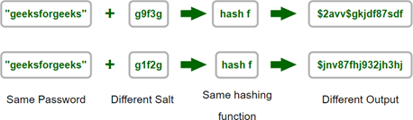

# Task 1 Python Programming Practical Task
This is the core respository for your first practical programming task.

## Allowed websites
Students who access other websites than listed here during the task will be instantly awarded a zero mark.
1. Anything pages contained within the GitHub Repo as long as you don't leave the repo
2. https://docs.python.org/3/library

## Allowed Extensions, Installs & libraries
All allowed extesnions, installs & libraries have already been included or used in example.py.
Students who install additonal extensions, pip installs or libraries will be instantly awarded a zero mark

## Files
- [source.txt](source.txt) is to be used by your application
- [plain_text.txt](plain_text.txt) is to help you with testing or can be used if you don't want to use plain text passwords.
- [README.md](README.md) contains core information
- Notes files contain the notes from the CS50 course:
    1. [Functions & Variables](0-FunctionsVariables/0-FunctionsVariables.md)
    2. [Conditionals](1-Conditionals/1-Conditionals.md)
    3. [Loops](2-Loops/2-Loops.md)
    4. [Debugging](Debugging/Debugging.md)
    5. [Exceptions](3-Exceptions/3-Exceptions.md)
    6. [Libraries](4-Libraries/4-Libraries.md)
    7. [Unit Tests](5-UnitTests/5-UnitTests.md)
    8. [File IO](6-FileIO/6-FileIO.md)

## Byte String Explained
str = '...' literals = a sequence of characters. A “character” is a basic unit of text: a letter, digit, punctuation mark, symbol, space, or “control character” (like tab or backspace). The Unicode standard assigns each character to an integer code point between 0 and 0x10FFFF. Internally, str uses a flexible string representation that can use either 1, 2, or 4 bytes per code point.

bytes = b'...' literals = a sequence of bytes. A “byte” is the smallest integer type addressable on a computer, which is nearly universally an octet, or 8-bit unit, thus allowing numbers between 0 and 255.

## How To Hash Passwords In Python
A strong password provides safety. Plain text passwords are extremely insecure, so we need to strengthen the passwords by hashing the password. Hashing passwords is a cheap and secure method that keeps the passwords safe from malicious activity. Password hashing generates a unique password for every text, even if the plaintext password is the same.
Why do we need to Hash a Password?
Hashing is used mainly to protect a password from hackers. Suppose, if a website is hacked, cybercriminals don’t get access to your password. Instead, they just get access to the encrypted “hash” created by the method of hashing.

### What is salt in hashing?
In cryptography, a salt is random data used as an additional input to a one-way function that hashes data, such as a password. Salts are used to keep passwords safe while they are being stored. Historically, only the password’s cryptographic hash function was maintained on a system, but over time, additional precautions were developed to prevent the identification of duplicate or common passwords. One such prevention is salting.

Encryption: Encryption is the process of encoding plain text or any information in such a way that only authorized people can read it with a corresponding key so that confidential data can be protected from unauthorized persons.
Hashing: Hashing converts any amount of data into a fixed-length hash that cannot be reversed. It is widely used in cryptography. The hash allows us to validate if the input has changed even slightly, if it is changed the resulting hash will be different. In this article, we are going to learn the Salted Password Hashing technique. It includes converting an algorithm to map data of any size to a fixed length.

### What is BCrypt?
The BCrypt Algorithm is used to hash and salt passwords in a secure way. BCrypt enables the creation of a password protection layer that can develop local hardware innovation in order to protect against long-term hazards or threats, such as attackers having the computational capacity to guess passwords twice as efficiently.

All the necessary code snippets for this task are found in [example.py](example.py).